COMENZANDO LA AVENTURA

Hemos creado una nueva VM por lo que no tenemos instalado ninguno de los programas necesarios para la actividad (Java, Apache, Tomcat, SSH ni MariaDB). Por ello esta guía no solo va a comprobar cada paso, sino que es una guía completa de instalación desde 0 de todos estos programas. ¡Vamos a ello!

JAVA INSTALACIÓN

Verificamos que no tenemos instalado JAVA empleando para ello el comando ***java --version***

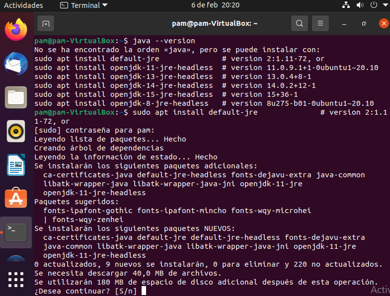

Nos comunica que no esta instalado pero que podemos hacer uso de alguno de sus comandos para poder hacerlo. Seguimos el primero de ellos y comenzamos la descarga, no sin antes introducir nuestra contraseña, como siempre ocurre ¿o no? Efectivamente, habrá uno de los programas que no nos solicite la contraseña. Algo, en el ámbito de la seguridad poco acertado, por lo que tendremos que crear algunos “corta-pasos” a los posibles “mal intencionados” pero para eso hay que esperar a llegar a él.

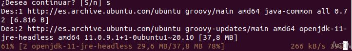

Una vez instalado comprobamos la versión que tenemos

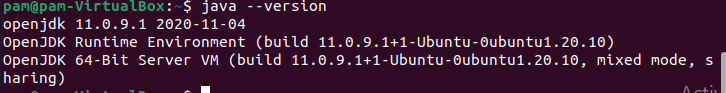

Ya tenemos Java instalado, fácil ¿verdad? Vayamos ahora con el segundo en la lista “Apache”

APACHE INSTALACIÓN

Como hemos hecho anteriormente, recurrimos al comando ***sudo apt install*** pero ahora con apache2

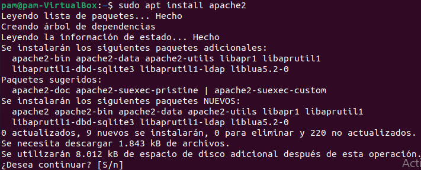

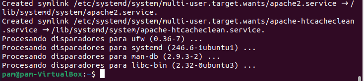

Y una vez finalizado el proceso, comprobamos la versión instalada

APACHE COMPROBACIÓN

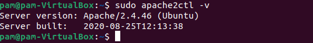

Antes de probar Apache, es necesario modificar la configuración del firewall para permitir el acceso externo a los puertos web predeterminados. Esto lo haremos suponiendo que tengamos configurado un [firewall como UFW]( t ) configurado para restringir el acceso al servidor.

Durante la instalación, Apache se registra con UFW y proporciona algunos perfiles de aplicación que se pueden usar para habilitar o deshabilitar el acceso a Apache a través del firewall.

Vamos a poder enumerar estos perfiles escribiendo ***sudo ufw app list***

Puerto 80

Puerto 80 y 443

Puerto 443

Puerto 443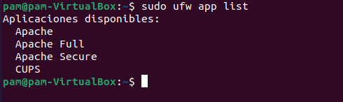

Vamos a permitir el acceso sólo a puertos 80 (aun no hemos conf. SSH) y comprobamos

Nótese la diferencia cuando hemos instalado posteriormente SSH

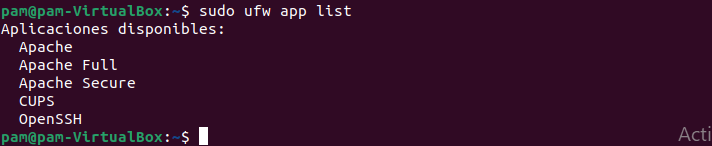

Verificamos el funcionamiento escribiendo ***sudo systemctl status apache2***

Como vemos sale activo pero la mejor manera de probar esto es solicitar una página de Apache.** Podremos acceder a ella a través de la dirección IP para confirmar que el software se ejecuta correctamente. Si no conoces la dirección IP, se puede obtener escribiendo en la terminal (Ctrl+Alt+T)

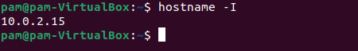

Con el comando ***hostname -I*** se nos mostrará algunas direcciones locales separadas por espacios (10.0.2.15 es nuestro caso) Podemos probar cada una en el navegador web para determinar si funcionan. Estas nos deben permitir ver la página web predeterminada de Ubuntu 20.04 Apache. Veamos si la comprobación sale correctamente:

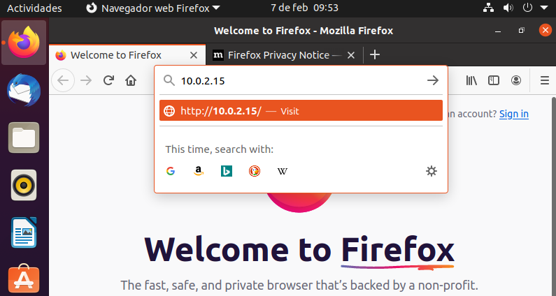

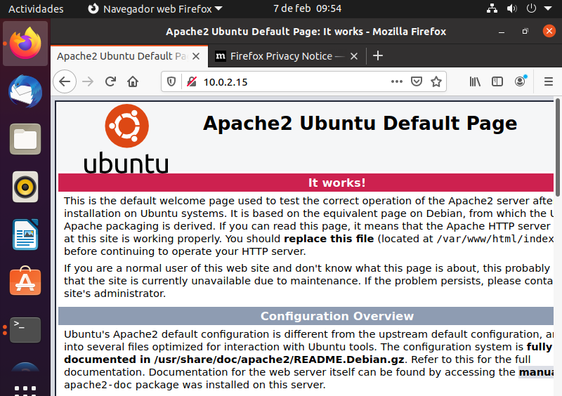

Parece que todo funciona como debe, vamos ahora a por Tomcat, que es algo más complicado que estos dos últimos procesos.

TOMCAT, UN PASO MÁS ALLÁ

El primer paso es instalar el paquete OPEN JDK en Ubuntu

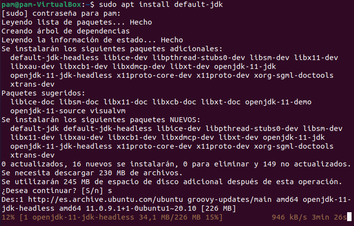

Ahora crearemos un usuario y grupo de sistema con el directorio de inicio con /opt/tomcat

Para comprobar que se ha creado, intento crearlo de nuevo y me devuelve esto

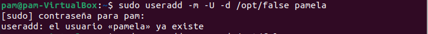

Ya puedo avanzar un poco mas. Vamos a instalar el paquete y utilizaremos wget y unzip para extraer el archivo

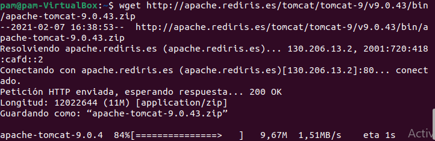

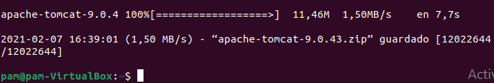

Nos movemos al directorio /tmp con el comando /cd delante

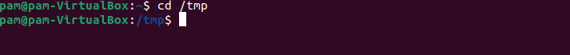

Y desde aquí vamos a extraer el archivo (con unzip)  y llevarlo al directorio /opt/tomcat

Aquí vemos como lo llevamos al directorio. Cuidado con los espacios entre / / que si no dará fallo

Para tener controladas mejor las versiones y las instalaciones, vamos a crear un “enlace ficticio” que va a apuntar al directorio donde está instalado tomcat

Ahora el usuario creado, recordemos que es “pamela”, necesita poder acceder al directorio de tomcat

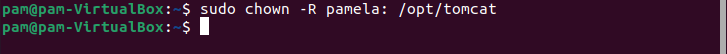

Y vamos a hacer que los script dentro del directorio sean ejecutables, usaremos ***chmod***  porque es el encargado de administrar los permisos de los archivos y carpetas

Para ejecutar Tomcat como servicio tenemos que crear un nuevo archivo que se llamara tomcat.service y lo guardaremos en el directorio /etc/systemd/system

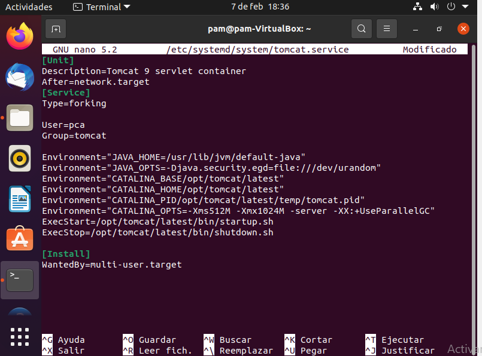

Vamos a ver que todo está donde debe

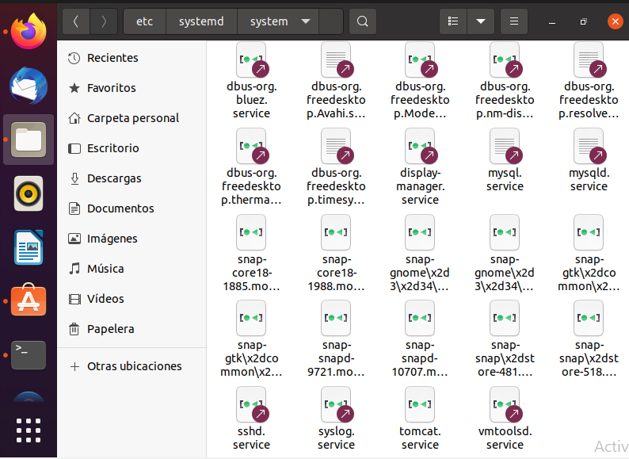

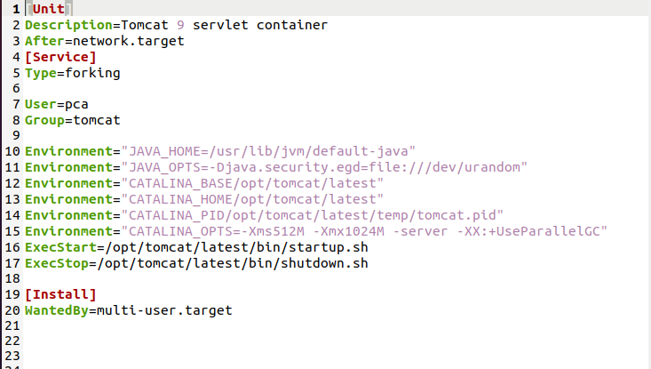

**[Unit]**

***Description=<descrición del unit>***

Una descripción del servicio que se muestra al consultar el status del servicio.

***After=<units>***

Define el orden en el cual los unist se inician. El unit se inicia sólo después de que los units especificados en esta línea estén activos. La diferencia con *Require* es que *After* no activa explícitamente los units indicados aquí. La opción **Before** tiene la funcionalidad opuesta a *After*.

***Requires=<units>***

Configuras las dependencias sobre otras units. Los units listados aquí serán activados junto con este unit. Si alguno de los units requeridos falla en el arranque, este unit tampoco se activa.

***Wants=<units>***

Activa los units indicados aquí. Wants configura dependencias de manera más débil que Require. Si alguno de los units indicados por Wants no se inician correctamente no tienen ningún efecto en el estado de este unit. Wants es la manera recomendada para establecer dependencias personalizadas.

**Conflicts=<units>**

Configura dependencias negativas, es decir, es un opuesto a *Requires*. El servicio no se inicia si el servicio indicado en esta línea está activo.

**[Service]**

***TimeoutStartSec=<n>***

Tiempo tras el cuál, si el servicio no ha arrancado, se considera fallo y se detiene.

***ExecStart=<ejecutable>***

comando a ejecutar.

***Type=<opción>***

Configura el tipo de arranque del procesos de la unidad la cual afecta a la funcionalidad ExecStart. Las opciones son:

- simple – Es el valor por defecto. El proceso arrancado con ExecStart es el proceso principal del servicio. Este proceso se arranca inmediatamente. El proceso no debe desencadenar otros procesos que requieran ejecución en el algún orden. No utilizar este tipo si otros servicios necesitan ejecutarse en orden con él.
- forking – El proceso iniciado con ExecStart genera un proceso hijo que se convierte en el proceso principal del servicio. Se sale del proceso padre cuando el arranque se completa. El uso de esta opción es importante cuando ejecutamos un script que a su vez ejecuta otros procesos. Sin la opción forking estos subprocesos podrían salir inesperadamente al concluir el proceso principal.
- oneshot – Similar a simple, pero se sale del proceso  antes de que se arranquen los subsiguientes units. Es útil para la ejecución de scripts que hacen un trabajo sencillo y luego salen. Con la opción RemainAfterExit=yes systemd considerará su proceso como activo después de que el proceso haya salido.
- dbus – Similar a simple, pero los subsiguientes units sólo son arrancados después de que el proceso principal adquiera un nombre D-Bus.
- notify – Similar a simple, pero los subsiguientes units sólo son arrancados después de que un mensaje de notificación se haya enviado mediante una función sd\_notify().
- idle – Similar a simple, la ejecución actual del binario del servicio se retrasa hasta que todos los trabajos se terminan, lo que evita la mezcla de la salida de estados con las salidas de los servicios por la Shell.

**[Install]**

*WantedBy=multi-user.target*

Indica el target al que pertenece este unit. Esto provoca que el comando systemctl enable <servicio>.service cree los enlaces simbólicos necesarios dentro del target multi-user.target.wants sin necesidad de hacerlo manualmente.

Lo que se consigue con esto es que el servicio se ejecute automáticamente al arrancar el target.

Ahora nos queda verificar el servicio. Iniciamos con el comando ***systemctl start tomcat,*** verificamos estado con ***status tomcat***

Ahora hacemos que se inicie Tomcat automáticamente con el inicio

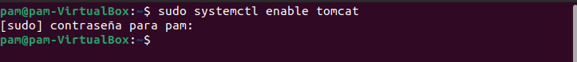

FIREWALL accesos

Si tienes instalado un firewall y quieres acceder a Tomcat desde el exterior a tu red local, tenemos que habilitar el puerto 8080, para ello usaremos el comando ***ufw allow 8080***

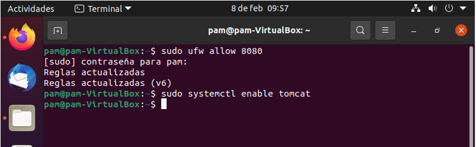

CONFIGURANDO TOMCAT WEB MANAGER INTERFACE

Ahora que tenemos Tomcat 9 instalado en nuestro Ubuntu, el siguiente paso es **crear un usuario que tenga acceso a la interfaz de administración web**. Los usuarios de Tomcat y sus roles se definen en el archivo *tomcat-users.xml*

Vamos a abrir el archivo (recuerdo que si no tienes instalado ***vim*** puedes hacerlo con el comando sudo apt-get install vim) ***sudo vim /opt/tomcat/latest/conf/tomcat-users.xml***

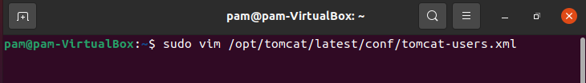

Para agregar un nuevo usuario que pueda acceder a la interfaz web de tomcat (*manager-gui y admin-gui*) necesitamos **definir el usuario al final del archivo tomcat-users.xml** 

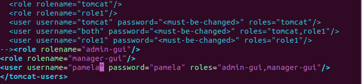

Verificamos que el usuario ha sido creado en el doc

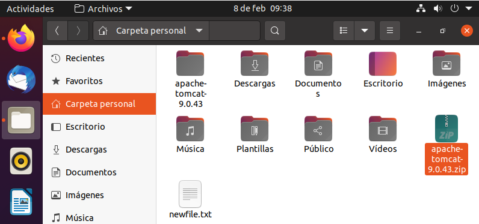

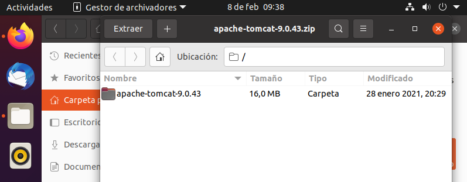

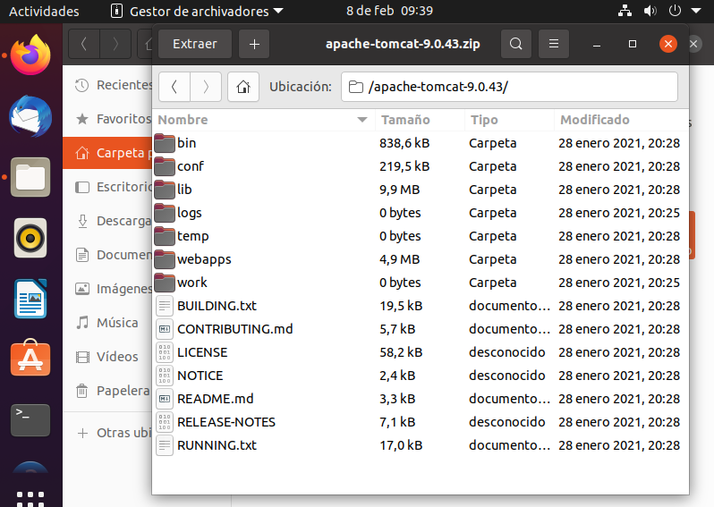

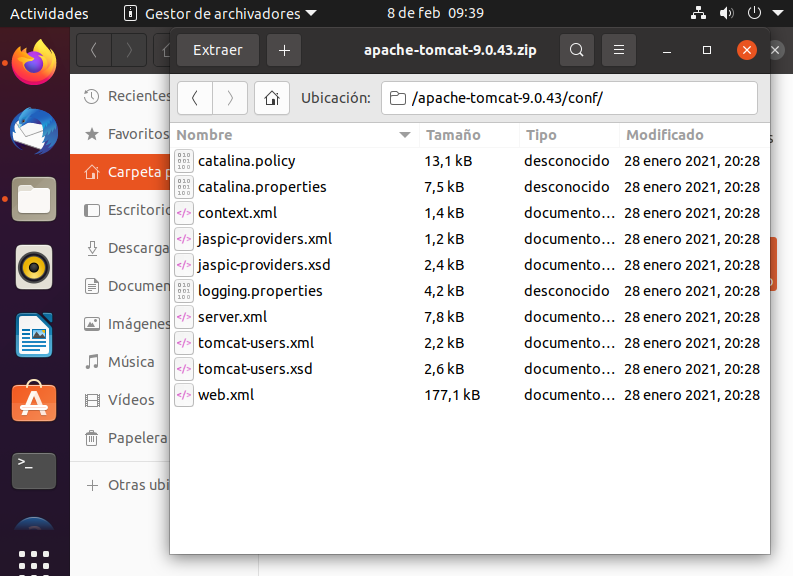

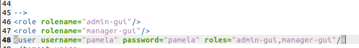

De forma predeterminada, **la interfaz de administración web de Tomcat está configurada para permitir el acceso solo desde el host local**. Si necesitas acceder a la interfaz web desde una IP remota abre los siguientes archivos y comenta o elimina las líneas marcadas en las capturas:

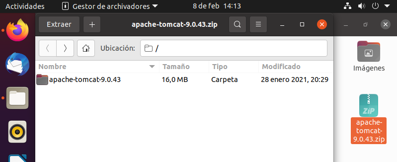

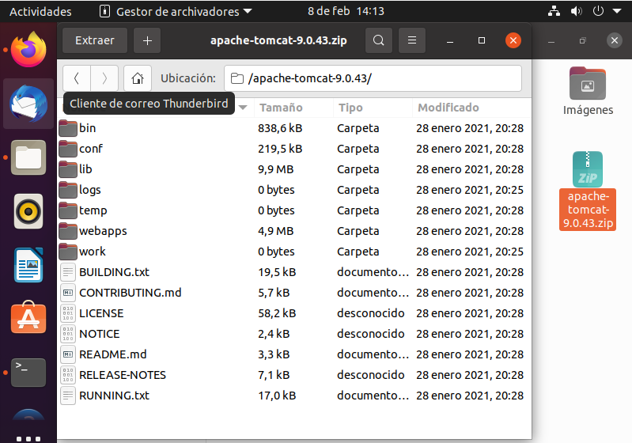

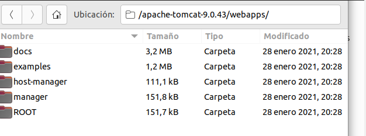

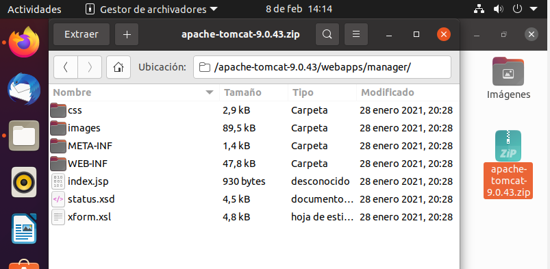

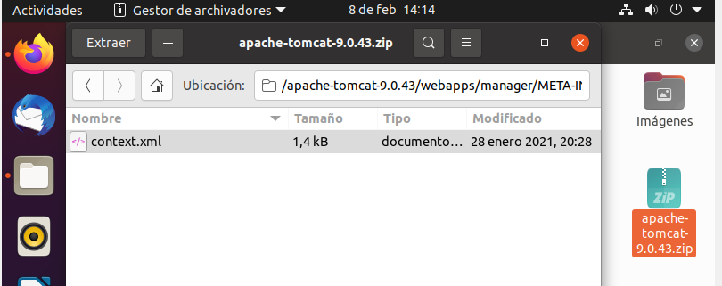

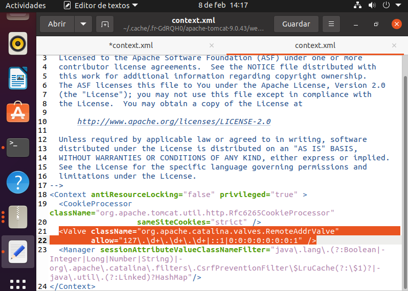

Ahora toca probar la instalación. Para ello abrimos el navegador e indicamos nuestra ip y el puerto 8080.

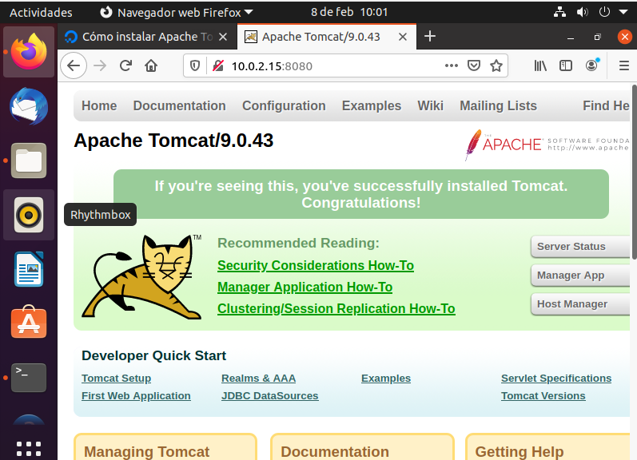

Pinchamos en Manager APP o en Host Manager y nos aparece la siguiente pantalla

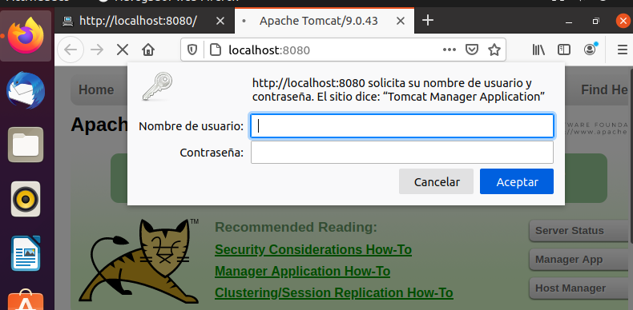

Ingresamos el usuario y la contraseña y accedemos al panel 

Y al gestor de la máquina virtual de Tomcat

OPENSSH INSTALACIÓN

Para poder instalar openssh escribimos en la terminal apt-get update y así actualizamos el sistema

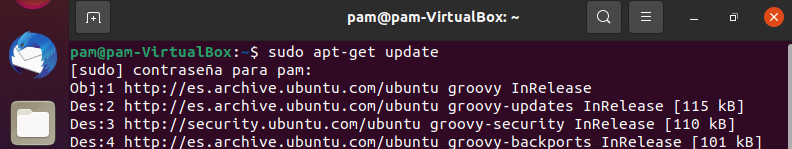

Y procedemos a su descarga usando el comando install openssh-server

Y porque suele ser recomendable, decidimos instalar la aplicación cliente con el siguiente comando

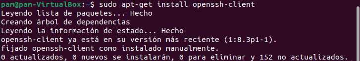

OPPENSH CONFIGURACIÓN: INICIAMOS Y COMPROBAMOS

Empleamos para ello los comandos start sshd.service y status sshd.service.

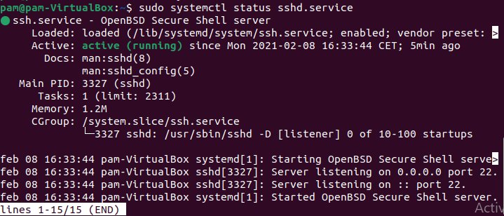

Investigando y llegado a este punto, nos aconsejan que cambiemos de puerto (señalado en la imagen como puerto 22) aumentando así la seguridad de las aplicaciones. Se haría desde el archivo /etc/ssh/sshd\_config por ejemplo al puerto 222.

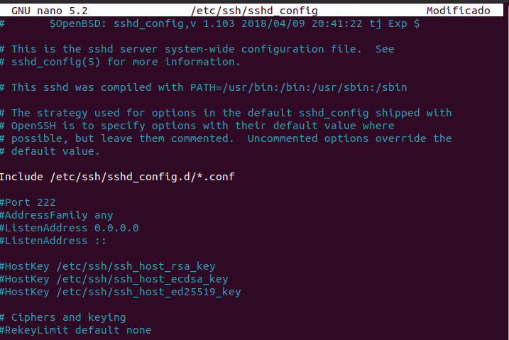

