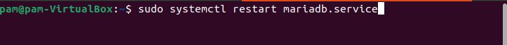

PAGE    \\* MERGEFORMAT**2**

PAGE    \\* MERGEFORMAT**2**

OPENSSH INSTALACIÓN

Para poder instalar openssh escribimos en la terminal apt-get update y así actualizamos el sistema

Y procedemos a su descarga usando el comando install openssh-server

Y porque suele ser recomendable, decidimos instalar la aplicación cliente con el siguiente comando

OPPENSH CONFIGURACIÓN: INICIAMOS Y COMPROBAMOS

Empleamos para ello los comandos start sshd.service y status sshd.service.

Investigando y llegado a este punto, nos aconsejan que cambiemos de puerto (señalado en la imagen como puerto 22) aumentando así la seguridad de las aplicaciones. Se haría desde el archivo /etc/ssh/sshd\_config por ejemplo al puerto 222.

MARIA DB INSTALACIÓN

Como siempre, actualizamos los paquetes

Para posteriormente instalar MARIA DB pero ¿Por qué no me solicita la clave? Directamente se empieza a cargar el paquete…pues simplemente porque la instalación de MARIADB es así de “segura”, por eso usaremos una línea de comandos que nos proporciona MARIA DB para impedir cuentas no deseadas. Usaremos en el siguiente paso el comando secure\_installation

Contraseña para la BDD que elegiremos *pca* y continuamos con la serie de batea de preguntas que figuran en la configuración

MARIA DB COMPROBACIÓN

Y comprobamos que funciona gracias al comando status mariadb y figura como activo

Y para finalizar el proceso, añadimos una comprobación extra con la bdd de MySql con el cliente admin para ejecutar procesos administrativos. Conectamos con MariaDB como root usando el socket Unix y devolviendo la versión.

Pero ¿esto es todo? Si MariaDB seguirá denegando cualquier acceso remoto de forma predeterminada. Por eso debemos seguir con el siguiente paso, configurar una dirección de enlace. Y nosotros vamos a hacer que todas las direcciones IPv4 sean accesibles ¿Cómo?

Accedemos al archivo con el editor nano /etc/mysql/mariadb.conf.d/50-server.cnf y buscamos la línea bind-address

Como queremos dar acceso a todas las IPv4 tenemos que definir la dirección por la siguiente

Reiniciamos MariaDB

Y como último paso, concedemos acceso al firewall a todas las IP entrantes con el primer comando, o exclusivamente a una o varias IP.

Ahora si que tenemos instalado y configurado correctamente MariaDB

