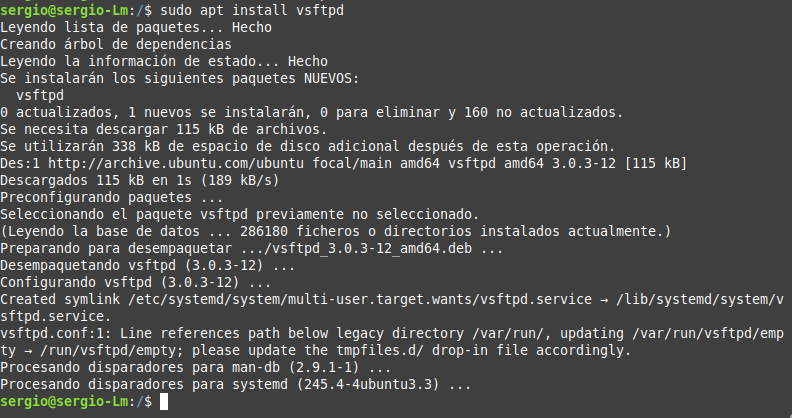
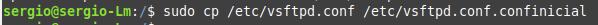
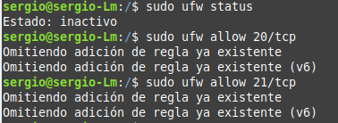
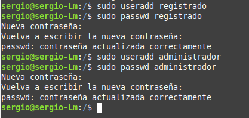
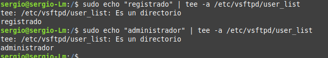
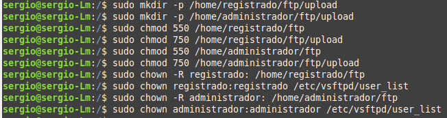
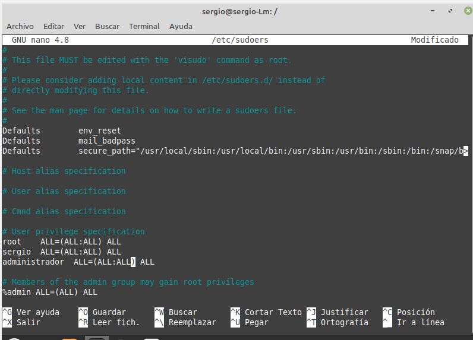
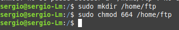
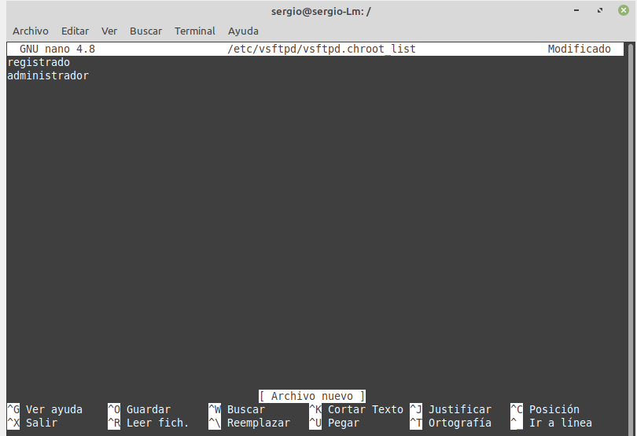
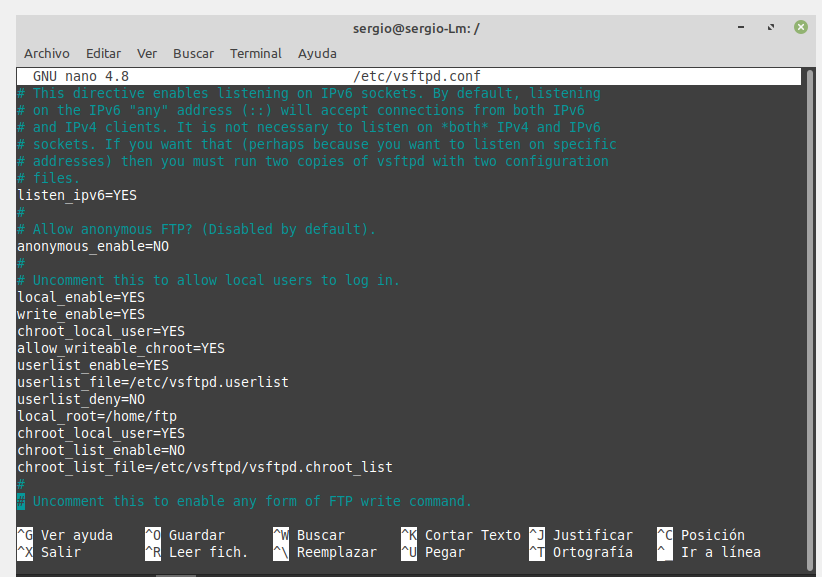

## ***4. FTP***
Instalamos **FTP Server** con el comando :

`  `sudo apt install vsftpd

Creamos una copia de seguridad antes de continuar ya que vamos a hacer cambios en el archivo vsftpd.conf

`  `sudo cp /etc/vsftpd.conf /etc/vsftpd.conf.confinicial

Ahora pasamos a habilitar y configurar el firewall:

  sudo ufw status

`  `sudo ufw allow 20/tcp

`  `sudo ufw allow 21/tcp

20 y 21 puertos de ftp.

Después vamos a crear los usuarios registrado y administrador y vamos a darles una password.

Primero creamos un directorio donde vamos a guardar una lista con los usuarios:

` `sudo mkdir /etc/vsftpd/user\_list

` `sudo nano /etc/vsftpd/user\_list/user.list

Añadimos restricciones a cada usuario:

` `sudo echo "registrado" | tee –a /etc/vsftpd/user\_list

` `sudo echo "administrador" | tee –a /etc/vsftpd/user\_list

Creamos las carpetas para los usuarios y le asginamos los permisos correspondientes: (leer y escribir)

A traves del commando *sudo nano /etc/sudoers* agregamos los permisos:

Vamos a crear una carpeta en /home que se llama ftp:

`  `sudo mkdir /home/ftp

Y le agregamos los permisos de lectura y escritura al usuario y al grupo de propietario con el 6, y el 4 al resto, que es de solo lectura.

Creamos un archive vsftpd.chroot\_list y añadimos los dos usuarios en el mismo:

`  `sudo nano /etc/vsftpd/vsftpd.chroot\_list

Ahora vamos a configurar los permisos de los usuarios en el archivo vsftpd.conf:

`  `sudo nano /etc/vsftpd.conf

Dentro de este archivo vamos a añadir y a modificar los siguientes parametros:

