
PAGE    \\* MERGEFORMAT**2**

PAGE    \\* MERGEFORMAT**2**

PAMELA CARRASCO ALONSO

DESPLIEGUE DE APLICACIONES WEB

Actividad 1

INDICE

CONEXIÓN 

2-4

ACCESIBILIDAD

5-6

PERTENENCIA DIRECCIÓN WEB

7-9

ACCESO A SERVIDOR

9-10

CONEXIÓN

La administración de un servidor web y/o un servidor de aplicaciones requiere unos conocimientos básicos de comandos de consola que permite visualizar qué está pasando en nuestro servidor. Se pide practicar y crear una guía de uso para las siguientes problemáticas que nos podemos encontrar:

¿Cuántas veces nos ha ocurrido que tenemos problemas con la conexión a internet? Por suerte existe un comando muy útil al que podemos recurrir para solventar varios problemas tales como renovar direcciones IP, vaciar caché DNS etc, nos estamos refiriendo al comando ipconfig. 

1. **Adaptador de LAN inalámbrica Wi-Fi** nos describe el adaptador que se ha usado para la conexión
1. **Dirección IPv4** que es la IP asignada al equipo local
1. **Puerta de enlace** dirección IP del equipo que funciona como servidor o proxi y que es el que tiene acceso a internet

Sin embargo, echo en falta otro tipo de información que con ***ipconfig*** no puedo obtenerla. Me gustaría saber otras cosas como los servidores DNS o el estado de DHCP. Para ello usaremos uno de los modificadores. Para conseguir esto uso ***/all***

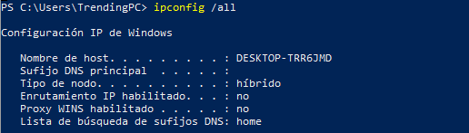

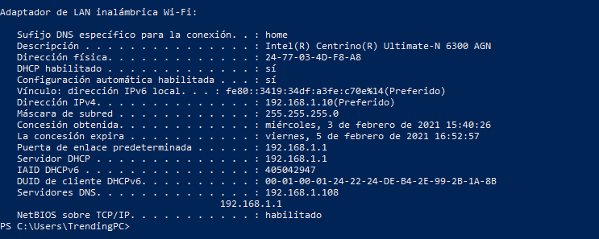

/release    Libera la dirección IP del adaptador especificado

/renew    Renueva la dirección IP del adaptador especificado

/displaydns    Muestra el contenido de la caché de resolución DNS

/flushdns    Vacía la memoria caché de resolución DNS

` `/registerdns    Actualiza todas las concesiones DHCP y vuelve a registrar los nombres DNS

/showclassid    Muestra todas las identidades (ID) permitidos para este adaptador

/setclassid    Modifica el identificador de clase

` `/allcompartments /all    Muestra información detallada sobre todos los compartimientos

Sin embargo existe otro tipo de comando al que podemos recurrir para determinar si un host destino, identificado con una determinada IP, es accesible desde otro host. Algo muy útil y eficaz porque cuántas veces no se nos ha cargado ninguna web y necesitamos saber si es culpa de nuestra red local, de los DNS o de nuestra conexión a internet. Vamos probando:

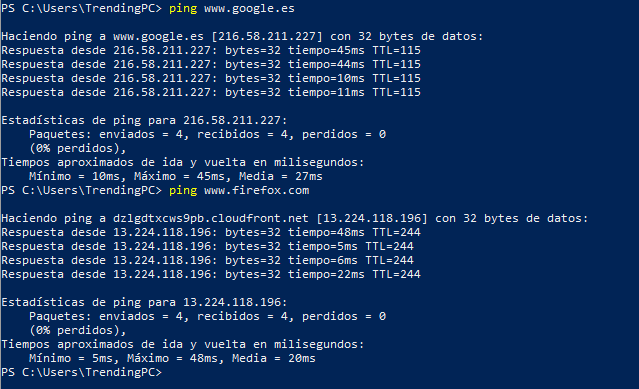

Vemos que poniendo unos servidores tan genéricos como [www.google.es]() o [www.firefox.com](), nos devuelven los 4 paquetes. Pero ¿y si ponemos la web del instituto?

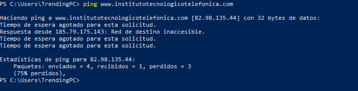

Devuelve unos paquetes y otros no, lo que nos indica que es algo temporal. Sin embargo, si no recibiéramos nada o si no hace el ping, el problema es nuestro y debemos recurrir a otros comandos (ping a la dirección IP de nuestro router; a los DNS haciendo ping a los servidores dando error y las IP funcionan, el problema vendría de los DNS…)

Sin embargo, no todos los servidores aceptan ping y hay routers que los cortan por seguridad por lo que no habría que dejar de lado a tracert que además de enviar un paquete a un destino como hace ping, va mostrando la ruta que éste sigue, incluyendo otros datos de interés como los tiempos que tarda en cada salto y los hosts que visita hasta llegar al destino. 

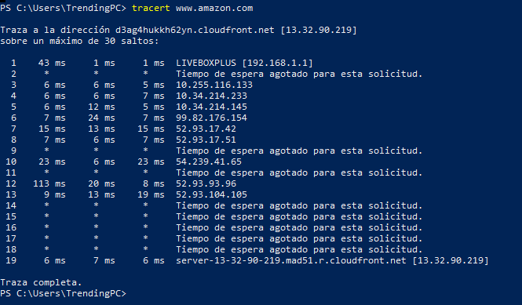

ACCESIBILIDAD

¿Cómo sabemos si nuestro servidor es accesible desde Internet?

Navegar por internet está muy bien, nosotros como programadores web no existiríamos sin él. Pero no seamos ilusos, cada vez que se hace uso de internet, dejamos “ventanas abiertas” a muchas personas que se dedican a adentrarse en nuestros puertos con diferentes fines tales como lanzar e introducir malware en nuestro sistema. Estas ventanas abiertas se traducen en nuestro mundo a los puertos. Por ello, es recomendable comprobar regularmente los puertos abiertos del sistema, tarea en la que destaca especialmente ***netstat*** ya que, si podemos encontrar puertos e IP desconocidos, podremos llegar a tiempo antes de un mal mayor como una infección en el sistema que nos arruine trabajo entre otras cosas.

Para conocer todos los parámetros que podemos usar con este maravilloso comando “espia”, declararemos en nuestra consola el comando ***netstat –?***

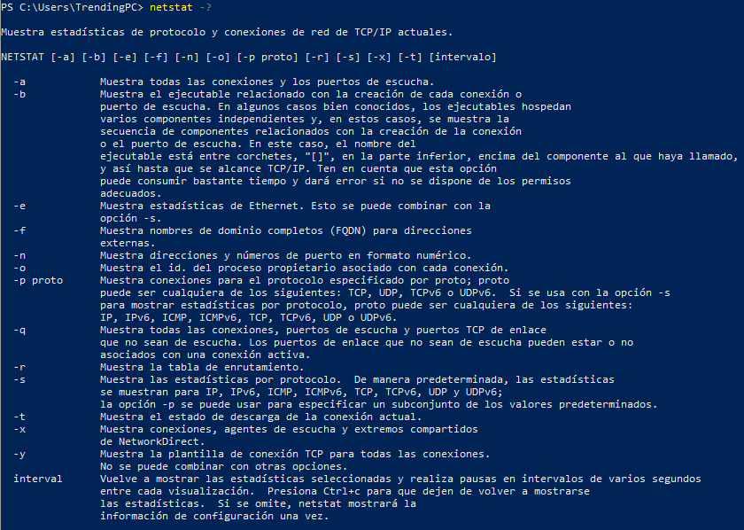

PERTENENCIA DIRECCIÓN WEB

¿Cómo sabemos a quién pertenece una dirección web (URL)?

Como el ser humano y la máquina no se terminan de “comprender” lingüísticamente, poseemos diferentes herramientas que nos sirven de traductores a la hora de conocer datos tan importantes como a quien pertenece una dirección web.

Sin embargo, debemos tener en cuenta que entre las máquinas y nosotros necesitamos “algo” que nos ayude a comunicarnos, como si se trata de un diccionario de idiomas. Las máquinas atienden a números y nosotros a uniones de vocales y consonantes (si se me permite el símil) y en esta “frontera” tenemos a los DNS que vienen a ser los receptores-traductores en esta relación y lo que hacen es traducir dominios (los nombres con los que se identifica una web) en direcciones IP. Estas direcciones IP nos comunican datos como el equipo donde está alojada determinada página web, pero, como hemos expuesto con los otros comandos, en muchas ocasiones pueden surgir problemas y necesitamos recurrir a herramientas que nos dirijan el camino de donde puede estar el error que genera esta situación.

NsLookUp es una herramienta gratuita que podemos utilizar en Windows, Linux y macOS. Con ella podemos conocer la IP de un dominio concreto o viceversa.

Pero más allá de conocer el nombre o dirección IP también sirve para solucionar problemas de resolución de nombres y comprobar el estado actual de los servidores.

Vamos a probar con Amazon a ver que conseguimos obtener:

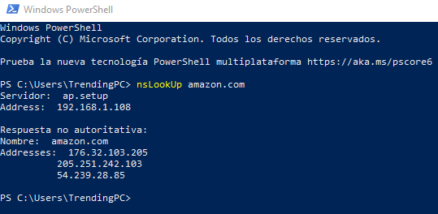

En primer lugar se nos muestra el nombre del servidor DNS (ap.setup) que es el que va a utilizar la herramienta para la consulta y, a continuación, aparece la dirección IP de este DNS.

En el segundo bloque aparece “Respuesta no autoritativa” que nos indica que el servidor DNS que nos ha contestado a la petición, no es el dueño del dominio que estamos consultando, es decir, tiene una copia de las consultas realizadas. Y en Addresses nos indican las direcciones que corresponden al dominio que hemos buscado (amazon.com).

Si buscamos una página menos “potente” veremos que los Addresses son mucho menores:

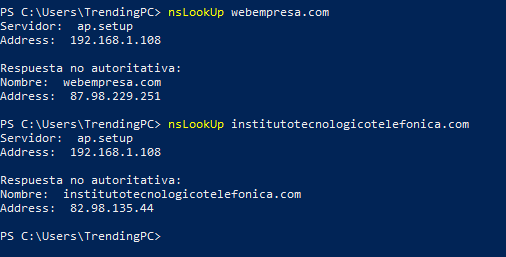

Para saber a qué dominio apunta una dirección, sólo indicando la dirección IP nos lo mostrará:

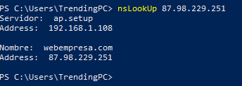

También podemos utilizar ***NsLookUp*** en modo interactivo. En este caso ejecutamos simplemente el comando nslookup.

Con este comando nos muestra el servidor DNS que estamos utilizando para realizar las consultas, así como su dirección IP. Debajo podremos ejecutar diferentes consultas para obtener información.

Podemos usar las diferentes opciones:

- **set type=A**, para buscar registros A.
- **set type=PTR**, para buscar registros reversos.
- **set type=MX**, para buscar los registros Mail Exchange del correo.
- **set type=TXT**, para buscar registros de texto como SPF o DKIM.
- **set type=CNAME**, para buscar alias del dominio.

Vamos a ver lo que nos muestra set type=CNAME de webempresa

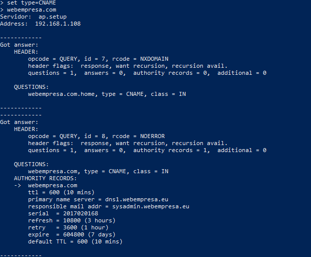

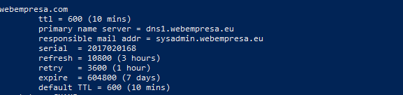

ACCESO A SERVIDOR

¿Cómo probamos que podemos acceder a un servidor?

Esta pregunta es muy importante para nosotros como desarrolladores web porque nos permite comunicarnos directamente con el servidor en lugar de tener que acceder a él desde un navegador.

Con cURL podemos comprobar si un servidor es accesible. En este sentido, el funcionamiento de *curl* es similar al del [comando ping](). Sin embargo, debido a los protocolos y las opciones disponibles, cURL se puede utilizar con más flexibilidad. Además, *ping* trabaja en la capa de Internet, mientras que cURL funciona sobre la capa de aplicación. Eso significa que *ping* verifica si la máquina está en red. En cambio, el cURL *command* siguiente comprueba si un servidor reacciona y cómo lo hace.

Pero al hacerlo desde PowerShell tenemos un problema ya que solo permite usar algunos de los comandos cURL, mientras que el resto debe *traducirse* para surtir efecto en PowerShell.

Por suerte, la función *traductora* está integrada directamente en PowerShell y puede activarse con ***GetAlias*** seguido del comando ***cURL.***

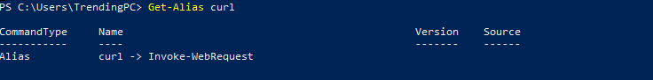

Desde ahí vamos a ejecutar comando de cUrl:

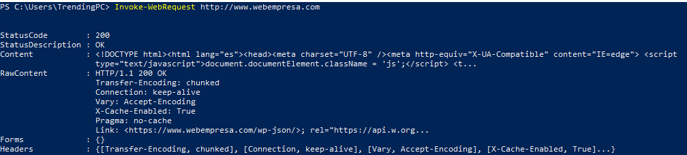

En Headers comprobamos la conexión a la url. La verdad es que este comando me ha traído un poco de cabeza porque probarlo en Ubuntu era muchísimo más fácil

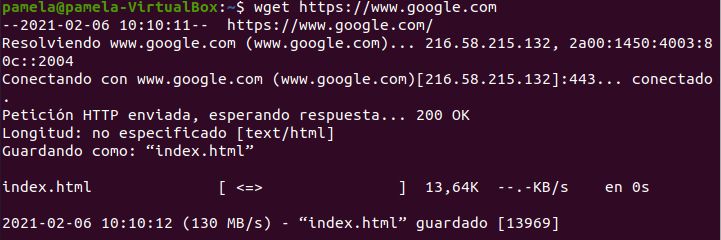

introduces el comando ***wget*** y enseguida te proporciona los datos. Para saber como tenia que usar este comando tuve que consultar la siguiente web https://[curl for Windows]().
