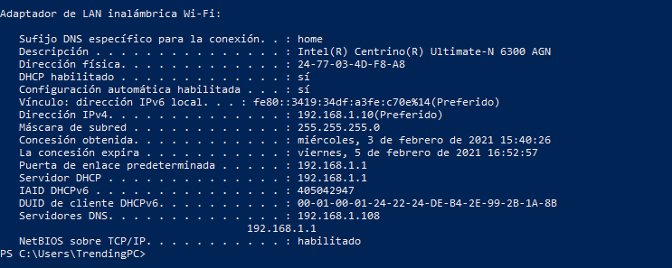
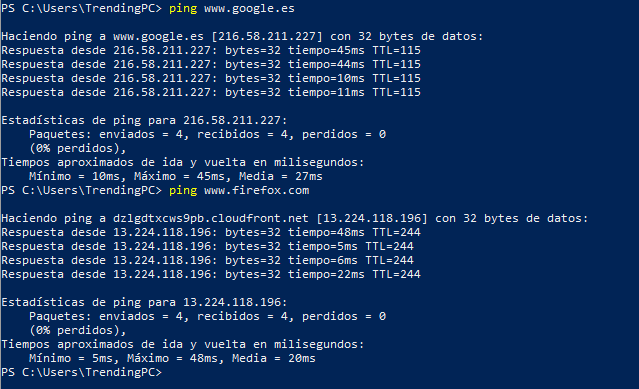
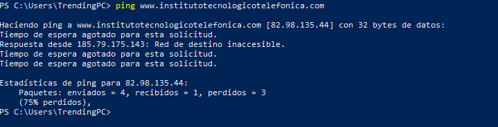
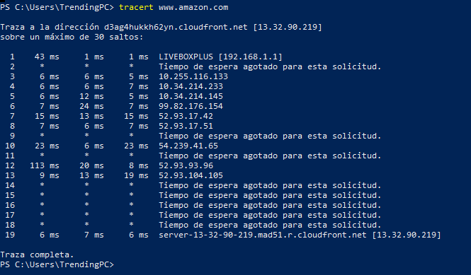

CONEXIÓN

La administración de un servidor web y/o un servidor de aplicaciones requiere unos conocimientos básicos de comandos de consola que permite visualizar qué está pasando en nuestro servidor. Se pide practicar y crear una guía de uso para las siguientes problemáticas que nos podemos encontrar:

¿Cuántas veces nos ha ocurrido que tenemos problemas con la conexión a internet? Por suerte existe un comando muy útil al que podemos recurrir para solventar varios problemas tales como renovar direcciones IP, vaciar caché DNS etc, nos estamos refiriendo al comando ipconfig. 

1. **Adaptador de LAN inalámbrica Wi-Fi** nos describe el adaptador que se ha usado para la conexión
1. **Dirección IPv4** que es la IP asignada al equipo local
1. **Puerta de enlace** dirección IP del equipo que funciona como servidor o proxi y que es el que tiene acceso a internet

Sin embargo, echo en falta otro tipo de información que con ***ipconfig*** no puedo obtenerla. Me gustaría saber otras cosas como los servidores DNS o el estado de DHCP. Para ello usaremos uno de los modificadores. Para conseguir esto uso ***/all***

/release    Libera la dirección IP del adaptador especificado

/renew    Renueva la dirección IP del adaptador especificado

/displaydns    Muestra el contenido de la caché de resolución DNS

/flushdns    Vacía la memoria caché de resolución DNS

` `/registerdns    Actualiza todas las concesiones DHCP y vuelve a registrar los nombres DNS

/showclassid    Muestra todas las identidades (ID) permitidos para este adaptador

/setclassid    Modifica el identificador de clase

` `/allcompartments /all    Muestra información detallada sobre todos los compartimientos

Sin embargo existe otro tipo de comando al que podemos recurrir para determinar si un host destino, identificado con una determinada IP, es accesible desde otro host. Algo muy útil y eficaz porque cuántas veces no se nos ha cargado ninguna web y necesitamos saber si es culpa de nuestra red local, de los DNS o de nuestra conexión a internet. Vamos probando:

Vemos que poniendo unos servidores tan genéricos como [www.google.es](http://www.google.es) o [www.firefox.com](http://www.firefox.com), nos devuelven los 4 paquetes. Pero ¿y si ponemos la web del instituto?

Devuelve unos paquetes y otros no, lo que nos indica que es algo temporal. Sin embargo, si no recibiéramos nada o si no hace el ping, el problema es nuestro y debemos recurrir a otros comandos (ping a la dirección IP de nuestro router; a los DNS haciendo ping a los servidores dando error y las IP funcionan, el problema vendría de los DNS…)

Sin embargo, no todos los servidores aceptan ping y hay routers que los cortan por seguridad por lo que no habría que dejar de lado a tracert que además de enviar un paquete a un destino como hace ping, va mostrando la ruta que éste sigue, incluyendo otros datos de interés como los tiempos que tarda en cada salto y los hosts que visita hasta llegar al destino. 

